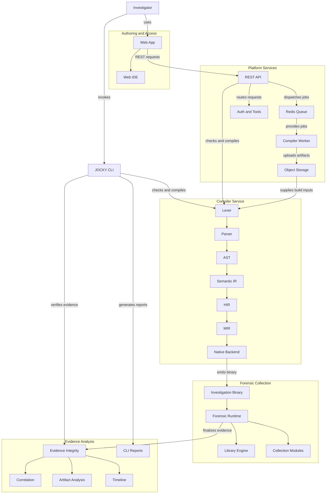

# JOCKY

### A programmable framework for digital forensics

JOCKY helps authorized response teams define, run, and verify repeatable endpoint investigations. Its purpose-built `.jy` language, cross-platform compiler, forensic collectors, and evidence-integrity tools bring collection and analysis into one workflow.

> **Collect with purpose. Preserve provenance. Verify every result.**

## Architecture


JOCKY brings investigators, the web IDE and CLI, platform services, the compiler, forensic runtime, and evidence-analysis modules together. The diagram is the high-level view; the capability registry tracks implementation status in detail.



## Why JOCKY

Digital investigations need consistent collection across operating systems, clear records of what each collector could access, and evidence that can be checked after it moves between teams. JOCKY provides a language for describing investigations and a workflow for collecting, packaging, and reviewing the resulting evidence.

This README focuses on JOCKY's authorized forensic collection and defensive-analysis workflows: observable system state, suspicious activity triage, and evidence integrity.

## Highlights

| Area | What JOCKY provides |
|---|---|
| Investigation language | Human-readable `.jy` files for selecting collectors, fields, filters, limits, and evidence exports. |
| Compiler | Lexer, parser, AST, semantic analysis, intermediate representations, and native code generation. |
| Cross-platform builds | Linux x64 and Windows x64 through the Rust backend; experimental LLVM backend. |
| Forensic collection | System, process, network, filesystem, memory, registry, logs, drivers, users, services, and other collector domains. Support varies by platform and permissions. |
| Evidence integrity | SHA-256 digests, Merkle roots and proofs, metadata sidecars, bundles, and tamper verification. |
| Analysis | Timeline construction, artifact inspection, and cross-collector correlation for investigation and triage. |
| Analyst tools | CLI, browser-based IDE, REST API, example investigations, and capability status reporting. |
| Operations | Role-based access, structured service logs, CI validation, and Linux/Windows packaging workflows. |

## Workflow

1. **Describe** an investigation in a `.jy` file or start from an example.
2. **Validate** syntax and collection directives with `jocky check` or the web IDE.
3. **Build or run** the investigation for a supported target using the CLI or API.
4. **Review** collector outcomes and generated evidence, metadata, and bundle.
5. **Verify** integrity and generate a report for downstream analysis.

The compiler pipeline is:

```text
.jy source -> Lexer -> Parser -> AST -> Semantic analysis -> IR / HIR / MIR -> Backend
```

The default Rust backend produces native Linux or Windows binaries. The LLVM backend is experimental and selected with `JOCKY_BACKEND=llvm`.

## Forensic Capabilities

### Collection domains

The runtime is organized into focused collectors. Exact fields and support depend on the operating system, permissions, and status recorded in the capability registry.

| Collector | Investigation data |
|---|---|
| System | OS and kernel details, host identity, boot time, CPU, and memory. |
| Processes | Process identity, parent relationships, command line, user, executable path, start time, and available hashes. |
| Network | Active TCP/UDP connections, endpoints, state, and associated process information where available. |
| Filesystem | File metadata, timestamps, traversal, and SHA-256/SHA-1/MD5 hashing. |
| Memory | Virtual memory regions, permissions, mapping information, and indicators useful for suspicious-memory triage. |
| Drivers and services | Loaded kernel modules, services, and driver inventory for review. |
| Registry and logs | Windows registry data and platform event/system logs where supported. |
| Artifacts and users | User/account data and supported operating-system or application artifacts. |
| Timeline and correlation | Chronological event views and relationships across process, network, and file data. |

### Threat behavior triage

JOCKY's collectors can provide evidence for reviewing behaviors such as these. Coverage depends on the target platform, permissions, and the implementation status in the capability registry. This section describes defensive investigation, not how to build or deploy these techniques.

| Investigation area | Evidence to review | Scope |
|---|---|---|
| Polymorphic or obfuscated artifacts | File and process hashes, code-signature state, metadata, and script-obfuscation indicators. | Compare artifacts and prioritize review; a hash difference alone does not establish maliciousness. |
| Fileless or memory-resident activity | Process memory maps, permissions, mapped modules, open files, and Linux deleted-executable indicators. | Supports memory and process triage; it is not a fileless execution mechanism. |
| Possible process injection | Memory-region details alongside process trees, loaded modules, threads, and process-associated connections. | Correlated indicators support investigation but do not prove a technique on their own. |
| Driver abuse or rootkit indicators | Kernel-module inventory, paths, versions, hashes, and signature state. | Kernel syscall-table inspection is Linux-only and requires elevated access. |
| Persistence | Available startup entries, run keys, scheduled tasks, services, cron entries, and systemd timers. | Review only capabilities marked implemented for the target platform. |
| Suspicious network activity | Process-associated connections, DNS data, listeners, routes, proxy settings, and firewall state. | Provides host-side context for analysis; it does not configure covert transport. |

JOCKY includes a registry of **172 forensic capabilities**, with status tracking to distinguish defined, partial, and implemented coverage. See [capabilities.json](capabilities.json) and [capabilities.md](capabilities.md).

### Evidence integrity and provenance

Collection output can include:

- `evidence.json` — collected records.
- `evidence.json.meta.json` — hashes, Merkle root, timestamps, tool version, host identifier, and available build provenance.
- `evidence.json.bundle.json` — records, manifest, and provenance in a transportable bundle.

Verification checks file integrity and Merkle data; deep verification can validate individual record proofs. Collector outcomes retain statuses such as success, partial, permission denied, unsupported, or requires elevation. Evidence origin can identify real, simulated, imported, or derived records.

```bash
jocky evidence verify evidence.json --meta evidence.json.meta.json
jocky evidence verify evidence.json --meta evidence.json.meta.json --deep
jocky report generate --format markdown evidence.json
```

## The JOCKY Language

An investigation is a named block containing collection directives and an export destination:

```text
investigation "process_triage" {
    collect processes {
        pid
        name
        parent
        command_line
        user
        hash.sha256
    }

    collect network_connections
    export evidence "process_triage_evidence.json"
}
```

The language supports investigation metadata, collection targets, field selection, hash options, limits, filters and pipeline stages, and evidence export. The parser provides diagnostics for editor feedback, and semantic analysis checks directives and expressions before code generation.

Start from [`examples/`](examples/), including:

| Example | Focus |
|---|---|
| `complete_forensic_triage.jy` | System, process, network, and file triage. |
| `process_triage.jy` | Process inventory and hashing. |
| `memory_triage.jy` | Virtual memory region review. |
| `network_investigation.jy` | Network connection analysis. |
| `filesystem_investigation.jy` | Filesystem traversal and metadata. |
| `registry_audit.jy` | Registry inspection. |
| `artifact_carving.jy` | Forensic artifact collection. |
| `evidence_hashing.jy` | Evidence integrity workflow. |
| `user_investigation.jy` | User and account review. |

## Getting Started

### Requirements

| Tool | Requirement | Used for |
|---|---|---|
| Rust | Stable toolchain; pinned in `rust-toolchain.toml`. | Compiler, runtime, API, and CLI. |
| LLVM | LLVM 18-compatible setup for the experimental backend. | Optional LLVM code generation. |
| Node.js | 20 or later. | Web frontend. |
| Docker Compose | Optional. | Local multi-service stack. |

### Build the CLI

```bash
git clone https://github.com/Aditya-180404/JOCKY.git
cd JOCKY
cargo build --release -p jocky-cli
```

The binary is at `target/release/jocky`. Run a first investigation:

```bash
./target/release/jocky --help
./target/release/jocky check examples/process_triage.jy
./target/release/jocky run examples/process_triage.jy --output ./evidence/
```

Verify the resulting evidence with its metadata sidecar:

```bash
./target/release/jocky evidence verify \
  ./evidence/process_triage_evidence.json \
  --meta ./evidence/process_triage_evidence.json.meta.json
```

### Start the API and web IDE

From the repository root, start the API:

```bash
cargo run -p jocky-api
```

In another terminal:

```bash
cd apps/web
npm install
npm run dev
```

The web IDE includes JOCKY editing, validation, compilation, evidence verification, examples, documentation, and package downloads. See [LINUX_RUN_GUIDE.md](LINUX_RUN_GUIDE.md), [WINDOWS_RUN_GUIDE.md](WINDOWS_RUN_GUIDE.md), and [`docs/`](docs/) for environment and deployment guidance.

### Docker Compose and demo

```bash
docker compose up --build
bash demo.sh
```

The demo exercises language validation, collection, compilation, evidence integrity, and tamper detection. `bash demo.sh fast` runs the abbreviated flow; generated files go to `demo-output/` and `demo-builds/`.

## CLI Overview

```text
jocky check <file.jy>
jocky compile <file.jy> --target linux|windows --arch x64|arm64 --output <dir>
jocky run <file.jy> --output <dir>
jocky evidence verify <evidence.json> --meta <meta.json> [--deep]
jocky report generate <evidence.json> --format terminal|markdown|json [--output <file>]
jocky doctor
jocky capabilities --format table|json
jocky ide
```

Use `jocky --help` and each command's help for options supported by the checked-out version. A target or capability may be defined without being fully implemented; check its status before planning a collection.

## API and Web IDE

The Axum/Tokio API provides:

| Endpoint | Purpose |
|---|---|
| `GET /health` | Service health. |
| `POST /api/compiler/check` | Validate `.jy` source and return diagnostics. |
| `POST /api/compiler/compile` | Compile source for a supported target. |
| `POST /api/compiler/run` | Run an investigation on the API host. |
| `POST /api/compiler/verify` | Verify an uploaded evidence file or bundle. |
| `GET /api/compiler/targets` | List compilation targets. |
| `GET /api/compiler/capabilities` | Return the forensic capability registry. |
| `/api/downloads/*` | Package information and CLI downloads. |
| `/api/auth/*` | Registration and login. |
| `/api/tools/*` | Tool and version repository operations. |

The React/TypeScript web application includes a Monaco-based editor, `.jy` examples, compile/check/verify actions, documentation, and download views. Authentication uses Argon2 password hashing and JWT access/refresh tokens; shared roles include Analyst, Admin, and Viewer.

> **Deployment note:** `POST /api/compiler/run` executes an investigation on the API host. Use a controlled environment, a restricted service account, and appropriate access controls. Do not expose a development deployment directly to untrusted networks.

## Repository Map

```text
compiler/       Language frontend, semantic analysis, IR, backends, and CLI
runtime/        Forensic collectors, evidence, correlation, capability registry
apps/api/       Axum/Tokio API service
apps/web/       React, TypeScript, and Vite web IDE
services/       Background compiler worker
examples/       Sample .jy investigations
packages/       Shared Rust types
migrations/     Database schema migrations
docker/         Container build and runtime configuration
packaging/      Linux and Windows package scripts
scripts/        Build, setup, and utility scripts
tests/          Integration and package verification tests
docs/           Language, API, security, deployment, and development guides
```

## Build and Quality Checks

GitHub Actions cover Rust formatting, linting, tests, and builds on Linux and Windows; web lint/build checks; and Debian packaging. End-to-end checks include evidence verification and tamper detection.

```bash
cargo fmt --all -- --check
cargo clippy --workspace --all-features -- -D warnings
cargo test --workspace --all-features
```

```bash
cd apps/web
npm ci
npm run lint
npm run build
```

## Responsible Use

Use JOCKY only on systems you own or are explicitly authorized to investigate. Confirm scope, permissions, data-handling requirements, and operational impact before collection. Treat evidence as sensitive, preserve its metadata and provenance, and verify bundles after transfer.

## Project References

- [Linux run guide](LINUX_RUN_GUIDE.md)
- [Windows run guide](WINDOWS_RUN_GUIDE.md)
- [Capability catalogue](capabilities.md)
- [Machine-readable capabilities](capabilities.json)
- [Example investigations](examples/)
- [End-to-end demo](demo.sh)
- [Project documentation](docs/)

---

**JOCKY** · SIH26148 · NTRO · Blockchain & Cybersecurity Track